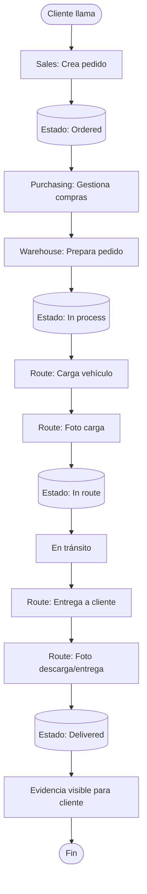

# Diagrama de Actividad (Ciclo de vida del pedido)

```mermaid
flowchart TD
    Start([Cliente llama]) --> CreateOrder[Sales: Crea pedido]
    CreateOrder --> Ordered[(Estado: Ordered)]
    Ordered --> Purchasing[Purchasing: Gestiona compras]
    Purchasing --> Warehouse[Warehouse: Prepara pedido]
    Warehouse --> InProcess[(Estado: In process)]
    InProcess --> RoutePrep[Route: Carga vehículo]
    RoutePrep --> PhotoLoad[Route: Foto carga]
    PhotoLoad --> InRoute[(Estado: In route)]
    InRoute --> Transit[En tránsito]
    Transit --> RouteDeliver[Route: Entrega a cliente]
    RouteDeliver --> PhotoDeliver[Route: Foto descarga/entrega]
    PhotoDeliver --> Delivered[(Estado: Delivered)]
    Delivered --> Evidence[Evidencia visible para cliente]
    Evidence --> End([Fin])
```
