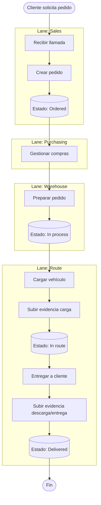

# Diagrama BPMN (Proceso de pedidos)

```mermaid
flowchart TD
    Start([Cliente solicita pedido])

    subgraph SalesLane [Lane: Sales]
        S1[Recibir llamada]
        S2[Crear pedido]
        S3[(Estado: Ordered)]
    end

    subgraph PurchasingLane [Lane: Purchasing]
        P1[Gestionar compras]
    end

    subgraph WarehouseLane [Lane: Warehouse]
        W1[Preparar pedido]
        W2[(Estado: In process)]
    end

    subgraph RouteLane [Lane: Route]
        R1[Cargar vehículo]
        R2[Subir evidencia carga]
        R3[(Estado: In route)]
        R4[Entregar a cliente]
        R5[Subir evidencia descarga/entrega]
        R6[(Estado: Delivered)]
    end

    End([Fin])

    Start --> S1
    S1 --> S2
    S2 --> S3
    S3 --> P1
    P1 --> W1
    W1 --> W2
    W2 --> R1
    R1 --> R2
    R2 --> R3
    R3 --> R4
    R4 --> R5
    R5 --> R6
    R6 --> End
```
