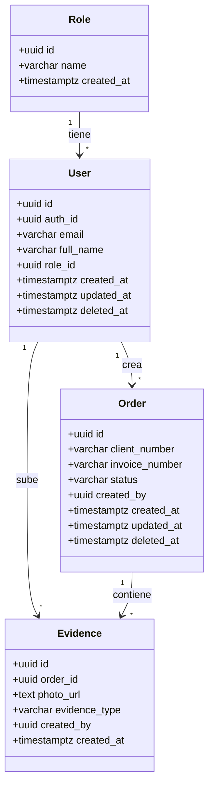

# Diagrama de Clases

```mermaid
classDiagram
    class Role {
        +uuid id
        +varchar name
        +timestamptz created_at
    }

    class User {
        +uuid id
        +uuid auth_id
        +varchar email
        +varchar full_name
        +uuid role_id
        +timestamptz created_at
        +timestamptz updated_at
        +timestamptz deleted_at
    }

    class Order {
        +uuid id
        +varchar client_number
        +varchar invoice_number
        +varchar status
        +uuid created_by
        +timestamptz created_at
        +timestamptz updated_at
        +timestamptz deleted_at
    }

    class Evidence {
        +uuid id
        +uuid order_id
        +text photo_url
        +varchar evidence_type
        +uuid created_by
        +timestamptz created_at
    }

    Role "1" --> "*" User : tiene
    User "1" --> "*" Order : crea
    User "1" --> "*" Evidence : sube
    Order "1" --> "*" Evidence : contiene
```
