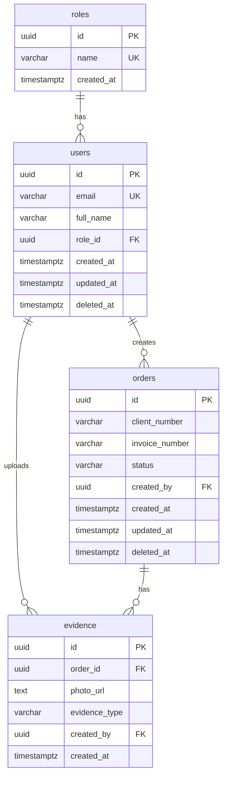

# Diagrama Entidad-Relación

```mermaid
erDiagram
    roles ||--o{ users : "has"
    users ||--o{ orders : "creates"
    users ||--o{ evidence : "uploads"
    orders ||--o{ evidence : "has"

    roles {
        uuid id PK
        varchar name UK
        timestamptz created_at
    }

    users {
        uuid id PK
        varchar email UK
        varchar full_name
        uuid role_id FK
        timestamptz created_at
        timestamptz updated_at
        timestamptz deleted_at
    }

    orders {
        uuid id PK
        varchar client_number
        varchar invoice_number
        varchar status
        uuid created_by FK
        timestamptz created_at
        timestamptz updated_at
        timestamptz deleted_at
    }

    evidence {
        uuid id PK
        uuid order_id FK
        text photo_url
        varchar evidence_type
        uuid created_by FK
        timestamptz created_at
    }
```
